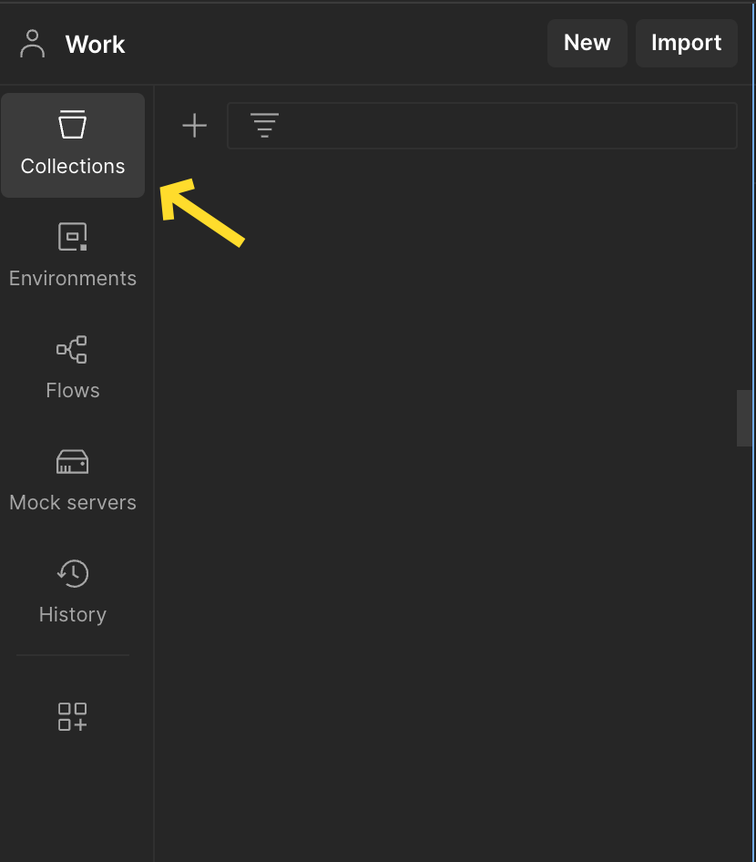

# GPC Demonstrator Replacement

A project to replace the GPC (GP Connect) demonstrator with a Postman collection that can be run as a mock server to return static responses.

## Project Overview

This project converts GP Connect acceptance test data into a Postman 
collection that can be used as a mock server. The mock server returns 
static responses based on the original test data, allowing developers 
to test their applications against the GP Connect API without needing 
the actual GPC demonstrator.

## Features

- Processes GPC acceptance test data from XML files
- Converts test data into Postman collections
- Categorizes tests as passed, failed
- Includes example responses with the original request information
- Supports JWT tokens and claims required

If you just want to run mock server you need Postman and you can skip 
to the [Running as a Mock Server](#running-as-a-mock-server) section

## Prerequisites

- Node.js (v12 or higher)
- Postman (for running the collection and mock server)

## Installation

1. Clone this repository:
   ```
   git clone -b postman-replacement https://github.com/nhsconnect/gpconnect-demonstrator.git
   ```

2. Install dependencies:
   ```
   npm install
   ```

## Usage Steps

1. Firstly run the following command
```bash
npm run pd
```
2. On Success, run the following command (this will create the postman collection)
```bash
npm run cc
```

3. Goto Postman and select `Collections` from the side menu
   
4. Drag the file called `GpcAcceptTestEndpoints.json` from the `_output` folder to your into the open space inside collections, or click the `+` icon and select the file location. 



You can now view all the pre-arranged endpoints, and their stubbed responses. 


## Run the Mock Server

In order to hit these mocked endpoints, you need to run a mock server within Postman.

1. In Postman, right click on the imported collection and find the `Mock` item (this could be hidden in `More` option)

2. Configure the mock server settings:
   - Name: Give your mock server a name (e.g 'GP Mock Server')
   - Environment: Select an environment if needed
   - Save responses: Enable this to save responses

3. Click "Create Mock Server"

4. Postman will provide a URL for your mock server - this will be used to pass to your application as the API url.

The mock server will now return the example responses included in the collection when matching requests are made.

## Updating The Example Responses (Optional)

The mock server uses the example responses included in the Postman collection.

To customize the responses, for whatever reason:

1. Open the collection in Postman
2. Navigate to the request you'd like to update
3. Expand the request and you'll see `example <name>` select this, alternatively use the `Examples` tab.  
4. Modify the response body, headers, or status code as needed
5. Save the changes

The mock server will use these updated responses when matching requests are made.

## Project Structure

- `src/`: Source code
  - `ProcessGpcAcceptanceTestData.js`: Processes GPC acceptance test data from XML files
  - `CreateCollection.js`: Creates a Postman collection from processed test data
  - `Postman.js`: Example usage of the Postman SDK for further documentation see [postmanlabs](https://www.postmanlabs.com/postman-collection/)
- `ExampleData/`: Contains example test data
  - Various test scenario directories with HttpContext.xml files
  - `output/`: Generated JSON files and Postman collections

## Contributing

Contributions are welcome! Please feel free to submit a Pull Request.

